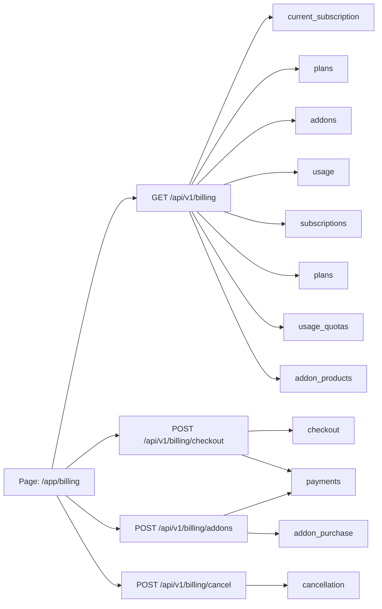

# Страница /app/billing: Page -> API -> DB tables

```mermaid
flowchart LR
    P["Page: /app/billing"] --> A1["GET /api/v1/billing"]
    P --> A2["POST /api/v1/billing/checkout"]
    P --> A3["POST /api/v1/billing/addons"]
    P --> A4["POST /api/v1/billing/cancel"]

    A1 --> D1["current_subscription"]
    A1 --> D2["plans"]
    A1 --> D3["addons"]
    A1 --> D4["usage"]

    A2 --> D5["checkout"]
    A3 --> D6["addon_purchase"]
    A4 --> D7["cancellation"]

    A1 --> T1["subscriptions"]
    A1 --> T2["plans"]
    A1 --> T3["usage_quotas"]
    A1 --> T4["addon_products"]
    A2 --> T5["payments"]
    A3 --> T5
```
