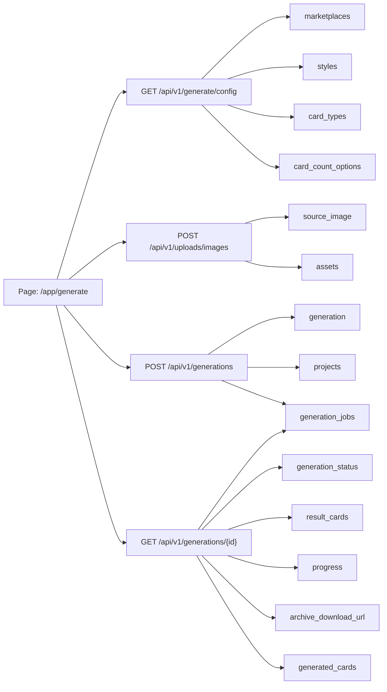

# Страница /app/generate: Page -> API -> DB tables

```mermaid
flowchart LR
    P["Page: /app/generate"] --> A1["GET /api/v1/generate/config"]
    P --> A2["POST /api/v1/uploads/images"]
    P --> A3["POST /api/v1/generations"]
    P --> A4["GET /api/v1/generations/{id}"]

    A1 --> D1["marketplaces"]
    A1 --> D2["styles"]
    A1 --> D3["card_types"]
    A1 --> D4["card_count_options"]

    A2 --> D5["source_image"]
    A3 --> D6["generation"]
    A4 --> D7["generation_status"]
    A4 --> D8["result_cards"]
    A4 --> D9["progress"]
    A4 --> D10["archive_download_url"]

    A2 --> T1["assets"]
    A3 --> T2["projects"]
    A3 --> T3["generation_jobs"]
    A4 --> T3
    A4 --> T4["generated_cards"]
```
