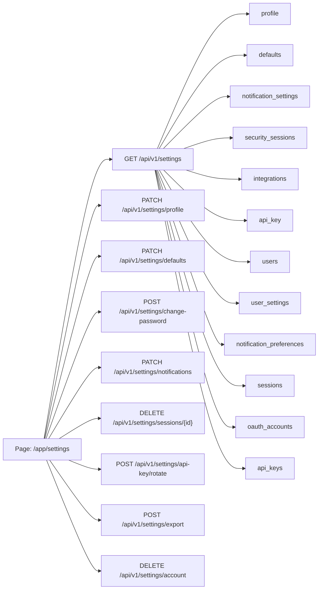

# Страница /app/settings: Page -> API -> DB tables

```mermaid
flowchart LR
    P["Page: /app/settings"] --> A1["GET /api/v1/settings"]
    P --> A2["PATCH /api/v1/settings/profile"]
    P --> A3["PATCH /api/v1/settings/defaults"]
    P --> A4["POST /api/v1/settings/change-password"]
    P --> A5["PATCH /api/v1/settings/notifications"]
    P --> A6["DELETE /api/v1/settings/sessions/{id}"]
    P --> A7["POST /api/v1/settings/api-key/rotate"]
    P --> A8["POST /api/v1/settings/export"]
    P --> A9["DELETE /api/v1/settings/account"]

    A1 --> D1["profile"]
    A1 --> D2["defaults"]
    A1 --> D3["notification_settings"]
    A1 --> D4["security_sessions"]
    A1 --> D5["integrations"]
    A1 --> D6["api_key"]

    A1 --> T1["users"]
    A1 --> T2["user_settings"]
    A1 --> T3["notification_preferences"]
    A1 --> T4["sessions"]
    A1 --> T5["oauth_accounts"]
    A1 --> T6["api_keys"]
```
