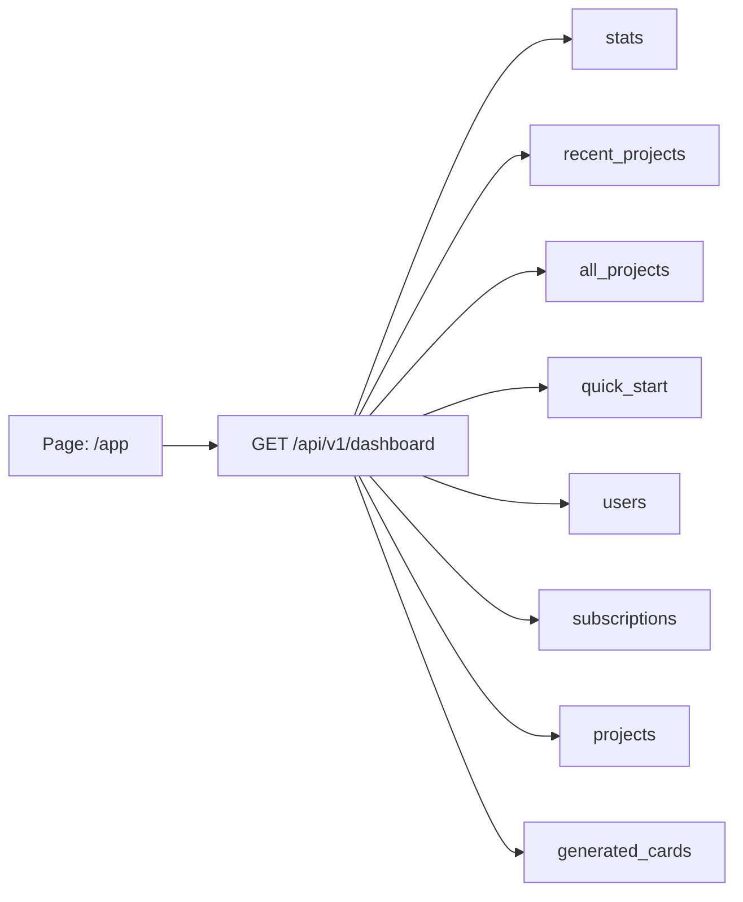

# Страница /app: Page -> API -> DB tables

```mermaid
flowchart LR
    P["Page: /app"] --> A1["GET /api/v1/dashboard"]

    A1 --> D1["stats"]
    A1 --> D2["recent_projects"]
    A1 --> D3["all_projects"]
    A1 --> D4["quick_start"]

    A1 --> T1["users"]
    A1 --> T2["subscriptions"]
    A1 --> T3["projects"]
    A1 --> T4["generated_cards"]
```
