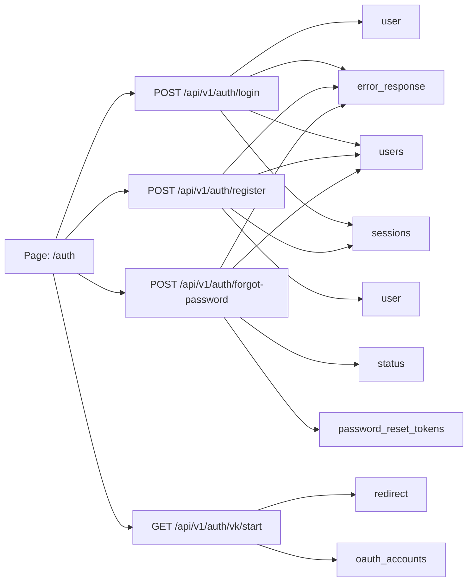

# Страница /auth: Page -> API -> DB tables

```mermaid
flowchart LR
    P["Page: /auth"] --> A1["POST /api/v1/auth/login"]
    P --> A2["POST /api/v1/auth/register"]
    P --> A3["POST /api/v1/auth/forgot-password"]
    P --> A4["GET /api/v1/auth/vk/start"]

    A1 --> D1["user"]
    A2 --> D2["user"]
    A3 --> D3["status"]
    A1 --> D4["error_response"]
    A2 --> D4
    A3 --> D4
    A4 --> D5["redirect"]

    A1 --> T1["users"]
    A1 --> T2["sessions"]

    A2 --> T1
    A2 --> T2

    A3 --> T1
    A3 --> T3["password_reset_tokens"]

    A4 --> T4["oauth_accounts"]
```
