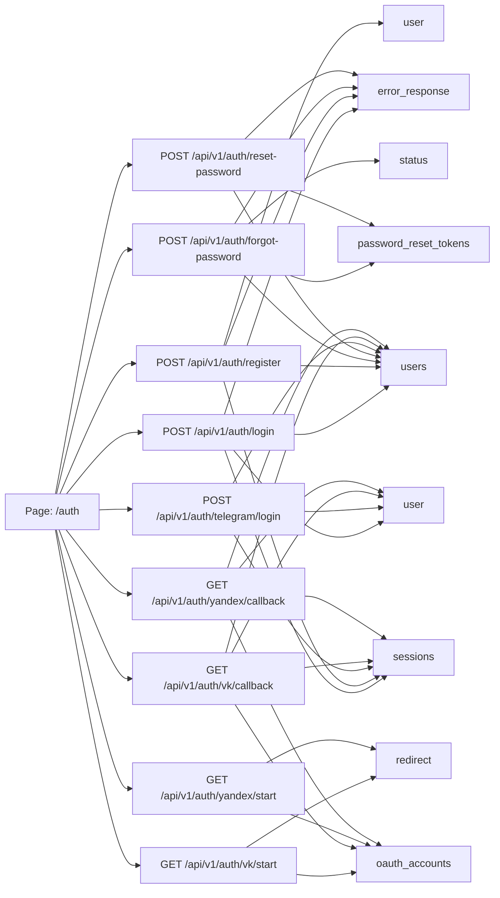
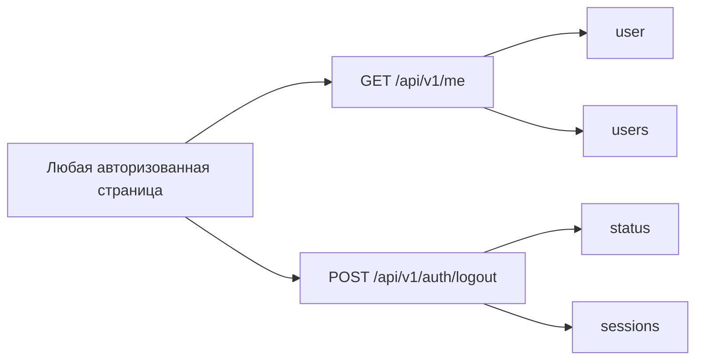

# Страница /auth: Page -> API -> DB tables

```mermaid
flowchart LR
    P["Page: /auth"] --> A1["POST /api/v1/auth/login"]
    P --> A2["POST /api/v1/auth/register"]
    P --> A3["POST /api/v1/auth/forgot-password"]
    P --> A4["POST /api/v1/auth/reset-password"]
    P --> A5["POST /api/v1/auth/telegram/login"]
    P --> A6["GET /api/v1/auth/vk/start"]
    P --> A7["GET /api/v1/auth/vk/callback"]
    P --> A8["GET /api/v1/auth/yandex/start"]
    P --> A9["GET /api/v1/auth/yandex/callback"]

    A1 --> D1["user"]
    A2 --> D2["user"]
    A3 --> D3["status"]
    A1 --> D4["error_response"]
    A2 --> D4
    A3 --> D4
    A4 --> D4
    A5 --> D1
    A6 --> D5["redirect"]
    A7 --> D1
    A8 --> D5
    A9 --> D1

    A1 --> T1["users"]
    A1 --> T2["sessions"]

    A2 --> T1
    A2 --> T2

    A3 --> T1
    A3 --> T3["password_reset_tokens"]

    A4 --> T1
    A4 --> T3

    A5 --> T1
    A5 --> T2

    A6 --> T4["oauth_accounts"]
    A7 --> T1
    A7 --> T2
    A7 --> T4

    A8 --> T4
    A9 --> T1
    A9 --> T2
    A9 --> T4
```

# Авторизованные запросы: Page -> API -> DB tables

```mermaid
flowchart LR
    P["Любая авторизованная страница"] --> A1["GET /api/v1/me"]
    P --> A2["POST /api/v1/auth/logout"]

    A1 --> D1["user"]
    A2 --> D2["status"]

    A1 --> T1["users"]
    A2 --> T2["sessions"]
```
