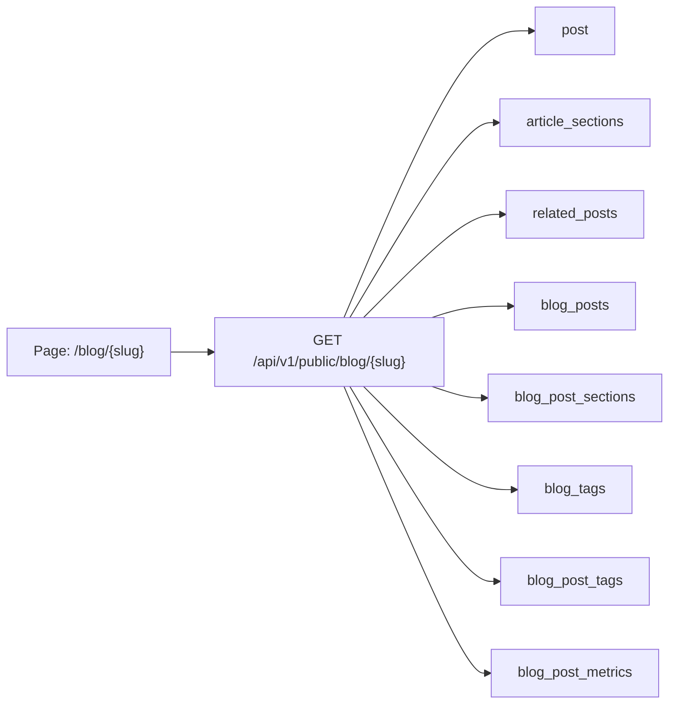

# Страница /blog/{slug}: Page -> API -> DB tables

```mermaid
flowchart LR
    P["Page: /blog/{slug}"] --> A1["GET /api/v1/public/blog/{slug}"]

    A1 --> D1["post"]
    A1 --> D2["article_sections"]
    A1 --> D3["related_posts"]

    A1 --> T1["blog_posts"]
    A1 --> T2["blog_post_sections"]
    A1 --> T3["blog_tags"]
    A1 --> T4["blog_post_tags"]
    A1 --> T5["blog_post_metrics"]
```
