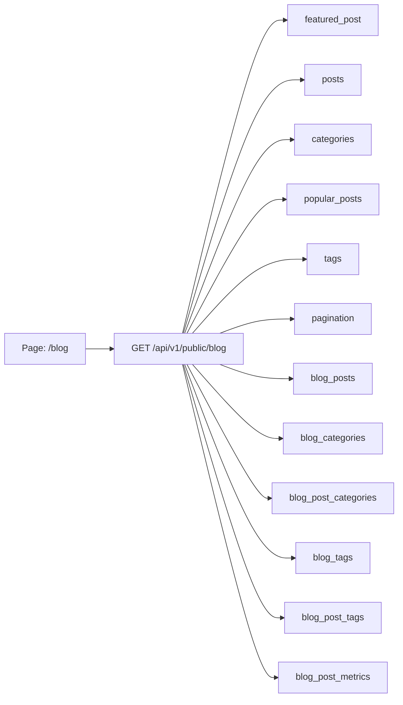

# Страница /blog: Page -> API -> DB tables



Пример оптимального ответа:

```json
{
  "featured_post": {
    "slug": "trebovaniya-foto-marketplejsy-2025",
    "title": "Требования к фото для маркетплейсов в 2025 году",
    "excerpt": "Размеры, фон, ракурсы и правила модерации в одной статье.",
    "published_at": "2025-04-03T00:00:00Z",
    "reading_time_minutes": 10,
    "canonical_path": "/blog/trebovaniya-foto-marketplejsy-2025"
  },
  "posts": [
    {
      "slug": "infografika-dlya-ozon-conversion",
      "title": "Как сделать инфографику для Ozon, которая увеличивает конверсию",
      "excerpt": "Разбираем структуру, иконки, тексты и цвета.",
      "category_label": "Инфографика",
      "published_at": "2025-03-28T00:00:00Z",
      "reading_time_minutes": 7,
      "canonical_path": "/blog/infografika-dlya-ozon-conversion"
    }
  ],
  "categories": [
    {
      "slug": "wildberries",
      "label": "Wildberries",
      "count": 9
    }
  ],
  "popular_posts": [
    {
      "slug": "trebovaniya-foto-marketplejsy-2025",
      "title": "Требования к фото для WB 2025",
      "canonical_path": "/blog/trebovaniya-foto-marketplejsy-2025"
    }
  ],
  "tags": [
    {
      "slug": "seo",
      "label": "SEO"
    }
  ],
  "pagination": {
    "page": 1,
    "page_size": 12,
    "total_pages": 11
  }
}
```

Пагинация для `/blog` нужна.

Оптимальный вариант:

- query params: `?page=1&page_size=12`
- серверная пагинация по номеру страницы
- сортировка по `published_at desc`

Почему это лучше здесь:

- для блога важны понятные URL и SEO-индексация страниц списка
- `page` проще для SSR/SSG и canonical/prev/next логики
- cursor pagination для публичного блога здесь избыточна
